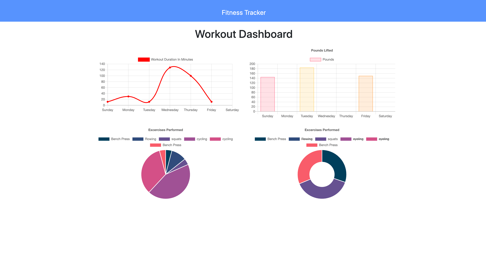

# 17-Training-Tracker

mongoose app that will help you track your workouts & train for your next marathon, race or just daily exercise.

For this development, I used a mongo for the database & mongoose to model it. We are using node for the runtime environment and express to run the router.

   
  <a href="https://workout-tracker-222000.herokuapp.com/">TRAINING TRACKER</a> 
     
  

# Description

This app will allow you to record, and track a series of workouts.  The home screen will ask you to input your workiouts.  Enter as many as you wish at that time.  After entering some workouts, click the stats button in the nav-bar at the top of the screen and the app will present you with data-visuial metrics.  Use the metrics to find ineffeciancies in your workout program, track days off and "stay in front of the curve", so to speak.

# Built with

- JavaScript
- MongoDB
- Mongoose
- Node.js
- Express
- HTML5
- CSS3

# Banter

    -   ALGORITHM OF SUCCESS
    while(noSuccess){
        tryAgain();
    if(dead)
    break();
    }
